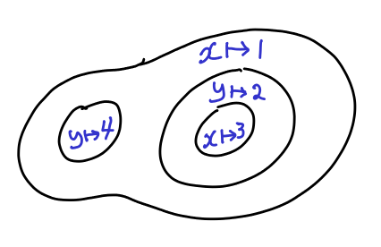

+++
title = "Review of Clojure"
author = "Ken Pu"
date = "2018-05-01"
+++

Clojure is very different from imperative languages such as Java / C / Go.
A Clojure program is represented entirely as a data structure.

<!--more-->

# Elements of Clojure

Let's first look at how Clojure represents data in its source file.

## Data in Clojure source file

### Literals: numbers, strings, characters

- They have the same representation as Java.

### Lists

- Lists are specified by parentheses '(' and ')'.

### Vectors

- Vectors are like arrays.  They are enclosed by '[' and ']'.

### Hashmaps

- Hashmap are also called dictionaries.  They store key-value pairs.  Anything
  can be a key.  Hashmaps are given as


{ <key> <value> <key> <value> ... }


### Symbols

- Symbols are commonly known as _variables_.  We will use the terminology
  symbols as they are part of _data_ specification.

    - This makes that we can generate symbols at runtime.
    - We can also define symbols in the source code - just like Java.

{}
My personal *favourite* feature of Clojure is amazingly generous
naming rule.

The following are all valid symbol names:

> - `get-record-from-id`
> - `id->record`
> - `x`, `x'`, `x''`
> - `<--*-->`: Yes, you can have a symbol like this.  It's crazy.
> - `∮`: Yes, this can be valid Clojure code: `(∮ x' dx)`
{}

### Keywords

- Keywords are another unique feature of Clojure.  They are equivalent to
the Java enum values.


:age
:runtime-port


- Keywords are great to be used as hashmap keys.  Keyword-key lookup in done in constant
  time.

## Binding & Scoping

### Binding

- Symbols are placeholders.  They are associated with data.
The association of a symbol to a value is called a _binding_.


Don't forget that data can be many things include other symbols.


### Scopes

- Clojure organizes its code into nested scopes using various
programming constructs.  So, the value that a symbol is bound to
depends on the scope that the resolution is performed in.

