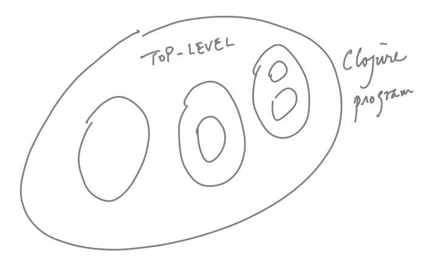

+++
title = "Syntax"
weight = 2
+++

Let survey the elements of Clojure constructs.  Each programming
construct is actually a fragment of Clojure's data descriptive language.

<!--more-->

### General Lisp s-forms

A s-expression is defined recursively as:

1. atoms are s-expressions: number, string, symbol
1. `( <atom>* )` are s-expressions

The _default_ semantics of s-expressions is function invocation:


In Python, we do:

```
print(a, b, c)
```

In s-expression we will have:

```
(print a b c)
```

Clojure extends s-expresses with its extended data structures:

1. Vectors
2. Hashmaps

We will refer to this extended s-expression syntax also as
s-expressions.

### Top-level symbols

Clojure programs start with a _top level_.



{}
Actually, later on, we will see that Clojure program
can (and usually do) have multiple top-level scopes
associated with different _namespaces_.
{}


Symbols can be defined at the top-level using the form.


(def pi 3.1415)

(def todos [{:priority 2
             :title "Summer school"
             :status :in-progress}

            {:priority 1
             :title "Course preparation"
             :note "CSCI 2000U is a new course"
             :status :incomplete}])


{}
Top-level symbol bindings are discouraged
*except* for top-level functions.
{}

## Scopes

Scopes are nested, and they are created _almost all the time_.
It might be useful to keep in mind the following:

1. When a new scope is created?
2. What are the bindings created in the new scope?

### The `let` form


(let [ <sym> <val> 
       <sym> <val>
       ... ] ...)



### Declaring functions

Functions are also data, and you construct a function-value using
the `(fn [...] ...)` form.

Here is a function-value that is declared, but not bound to any symbol.


(fn [a b c]
  (let [n 3]
    (/ (+ a b c) n)))


{}
In side the fn form, we have _four_ symbols.  Note that there
is no bindings for `a`, `b` nor `c` because these bindings
will be created only when the function is applied to given
arguments.
{}

We can bind the function to a symbol so it can be used repeatedly.


(def avg-3 (fn [a b c] 
             (/ (+ a b c) 3)))



# Try it out:

<iframe height="400px" width="100%"
src="https://repl.it/@kenpu/Learning-Clojure?lite=true" scrolling="no"
frameborder="no" allowtransparency="true" allowfullscreen="true"
sandbox="allow-forms allow-pointer-lock allow-popups allow-same-origin
allow-scripts allow-modals"></iframe>
